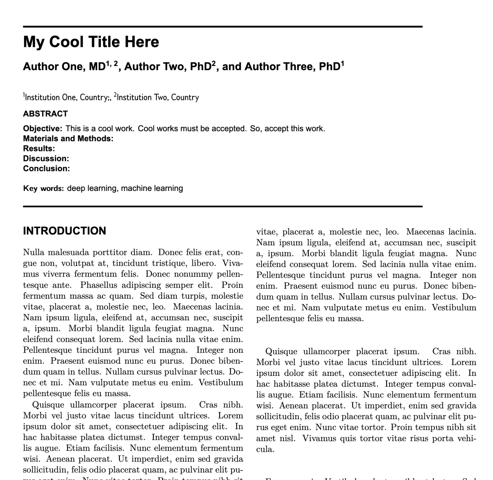

# JAMIA LaTeX paper template

The American Medical Informatics Association (JAMIA) paper basic template, inspired by [the LaTeX template of AMIA](https://github.com/emir-munoz/amia-paper-template) for the same reasons.

## Usage
1. You can upload the template to [Overleaf](https://www.overleaf.com/) after downloading it. 
**OR**, after Forking the repository, click “New Project” and “Import from GitHub” in Overleaf.

2. Go to Menu, change Compiler from `pdfLaTeX` to `XeLaTeX`

## Bibliography
This template uses `vancouver`.

## Example
The complete example is in the `build` folder.

  

